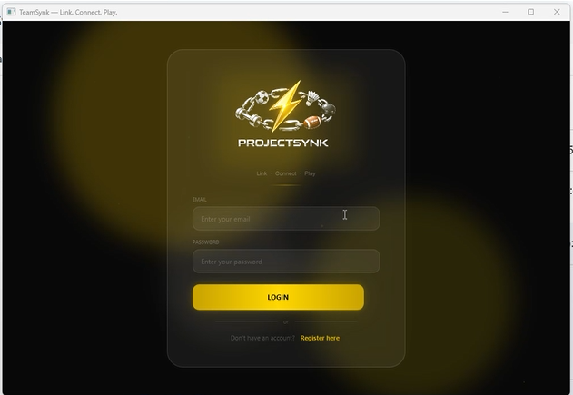
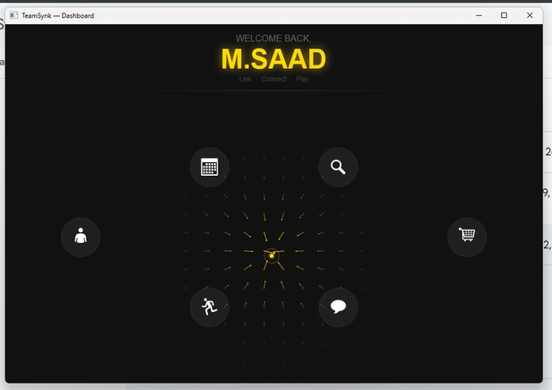
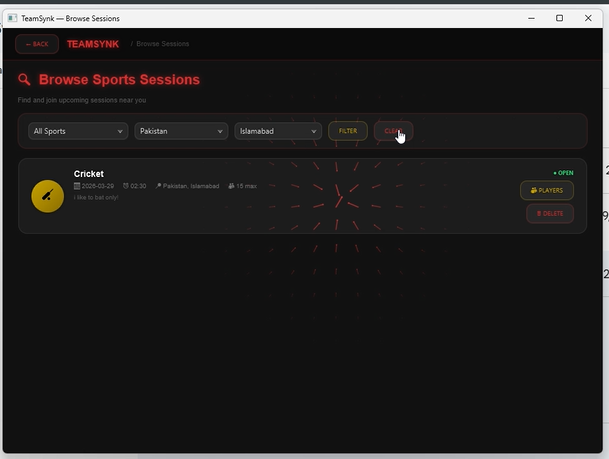
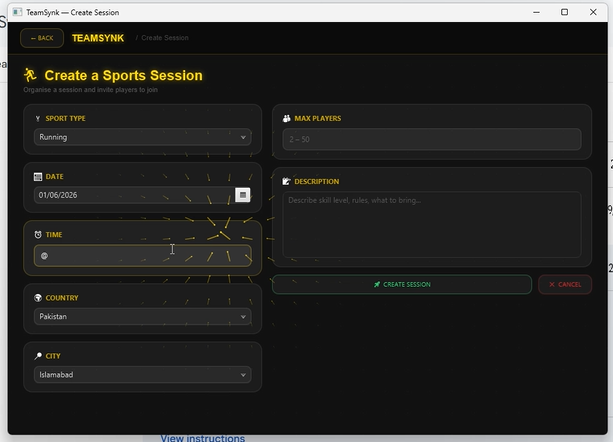
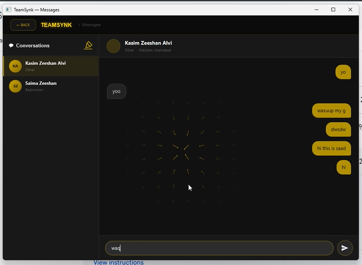
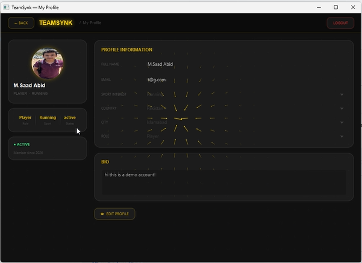

# TeamSynk — Sports Session Management Platform

TeamSynk is a desktop application built as a Software Design and Analysis (SDA) project. It brings together session management, player discovery, direct messaging, a sports equipment marketplace, and profile management into a single cohesive platform — all backed by a SQL Server database through a clean layered architecture.

> 🚧 The project is actively under development. Source code is private while improvements are ongoing.

---

## 👨‍💻 Team Members

| Name | Roll Number |
|------|-------------|
| Sarim | 24I-0668 |
| Kasim | 24I-0549 |
| Abdullah | 24I-0569 |

---

## ✨ Features

- **User Authentication** — Register and login with email/password, with role-based access (player / admin)
- **Sports Session Management** — Create sessions with sport type, date, time, location, and participant cap
- **Browse & Join Sessions** — Browse all available sessions and request to join
- **Find Players** — Search and filter other users by sport interest and location
- **Direct Messaging** — Real-time conversation view between any two users
- **Equipment Marketplace** — List, browse, and manage sports equipment for sale with image support
- **User Profiles** — View and edit your profile including bio, sport interest, location, and profile picture
- **Admin Panel** — Manage users and marketplace listings with elevated privileges
- **Animated JavaFX UI** — Custom-styled screens with fade/translate animations, canvas particle effects, and a custom cursor

---

## 🛠️ Technologies

| Technology | Purpose |
|------------|---------|
| Java 25 | Core application language |
| JavaFX 25 | GUI framework (all screens) |
| JDBC | Database connectivity |
| Microsoft SQL Server | Data persistence (`teamsynk_db`) |
| mssql-jdbc 13.2 | SQL Server JDBC driver |
| OOP / DAO Pattern | Layered software architecture |
| UML | System design diagrams |

---

## 🏗️ Architecture

The project follows a three-layer architecture:

```
┌─────────────────────────────────┐
│           UI Layer              │
│  JavaFX Screens (teamSynk.ui)   │
│  LoginScreen  RegisterScreen    │
│  DashboardScreen                │
│  BrowseSessionsScreen           │
│  CreateSessionScreen            │
│  FindPlayersScreen              │
│  MessagesScreen                 │
│  MarketplaceScreen              │
│  ProfileScreen  AdminScreen     │
└────────────┬────────────────────┘
             │  calls
┌────────────▼────────────────────┐
│           DAO Layer             │
│  (teamSynk.dao)                 │
│  UserDAO  SportsSessionDAO      │
│  MessageDAO  ProfileDAO         │
│  MarketplaceDAO                 │
└────────────┬────────────────────┘
             │  via DBConnection
┌────────────▼────────────────────┐
│         Model Layer             │
│  (teamSynk.model)               │
│  User  SportsSession  Message   │
│  Profile  MarketplaceListing    │
└────────────┬────────────────────┘
             │
┌────────────▼────────────────────┐
│  Microsoft SQL Server           │
│  teamsynk_db                    │
│  (Integrated Security / local)  │
└─────────────────────────────────┘
```

The entry point (`main.java`) extends `javafx.application.Application` and launches `LoginScreen` on the primary stage.

---

## 📸 Screenshots

### Login Screen


### Dashboard


### Browse Sessions


### Create Sports Session


### Messaging System


### User Profile


---

## 📂 Project Structure

```
teamsynk-sports-platform/
│
├── DiagramsSDA/
│   ├── Class Diagram.png
│   ├── Domain Model.png
│   ├── Package Diagram.png
│   ├── Deployment Diagram.png
│   ├── Sequence Diagram/        # SD part1–3
│   ├── System Sequence Diagram/ # UC 1–12
│   └── All use cases.docx
│
├── images/                      # Screenshots used in this README
├── diagrams/
├── README.md
├── LICENSE
└── .gitignore
```

> Source code is kept in a private repository while the project is being actively developed.

---

## 🎥 Demo Video

📽️ [Watch on YouTube](https://youtu.be/kEyowsk1Qjw)

---

## 📌 Note

This repository serves as the public showcase and documentation page for TeamSynk. The source code is currently private as the team is still actively building and refining the platform.

---

## 📜 License

This project is licensed under the MIT License.
